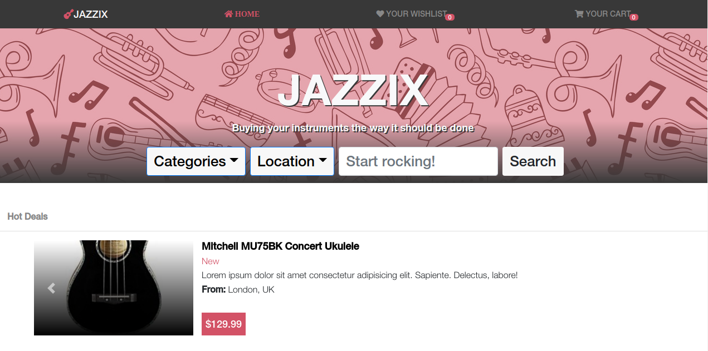

# Jazzix

This React project was created based on a previous Capstone Project from the Microverse Program (https://github.com/abouhid/HTML-CSS-Capstone-Project).
The whole concept of it is developing the back-end code for a front-end I created 6 months before, training how to work with a legacy. 
It is supposed to simulate a Shopping website for musical instruments.
In this website you are able to: 
- Add items to your Cart;
- Add items to your Wishlist;
- Place an order;
- Fake search for instruments;

## Live Demo

[Live Demo Link](https://jazzix.netlify.app/)

## Built With

- React / React-Bootstrap
- Javascript
- HTML / CSS

## Getting Started

To get a local copy up and running follow these simple example steps.

- Git clone git@github.com:abouhid/Jazzix.git
- Move to the root directory in your command line
- run `npm install`
- run `npm start`

## Authors

👤 **Alexandre Bouhid**

- Github: [@abouhid](https://github.com/abouhid)
- LinkedIn: [Alexandre Bouhid](https://www.linkedin.com/in/alexandrebouhid/)

## 🤝 Contributing

Contributions, issues and feature requests are welcome!

## Show your support

Give a ⭐️ if you like this project!

## 📝 License

This project is [MIT](lic.url) licensed.